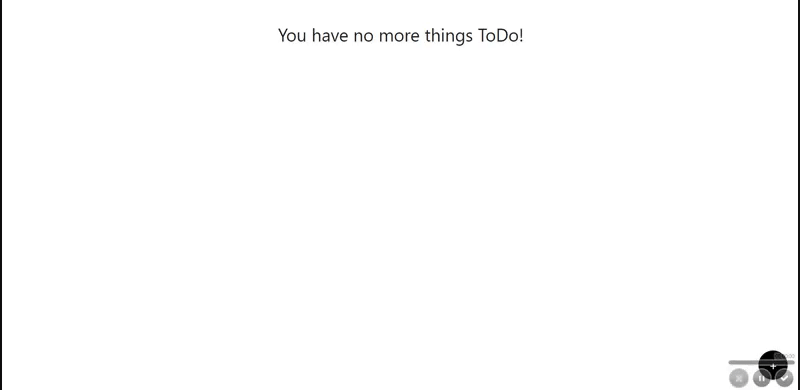

# FirexTodo

## Tecnologias usadas
Este maravilhoso projeto está sendo desenvolvido com as seguintes tecnologias:

- [React](https://reactjs.org)
- [Redux](https://redux.js.org/introduction/getting-started)
- [Firebase](https://firebase.google.com/?hl=pt-br)
- [HTML5](https://www.w3schools.com/html/html5_intro.asp)
- [CSS3](https://www.w3schools.com/css/)
- [JavaScript](https://www.javascript.com/)

## :computer: Projeto

Task List.

## Homepage

<h1 align="center"></img></h1>

## :memo: Licença

This project is under the MIT license. See the archive [LICENSE](LICENSE) for more details.

---

Done with ❤️ by  Henrique Brites :wave:
